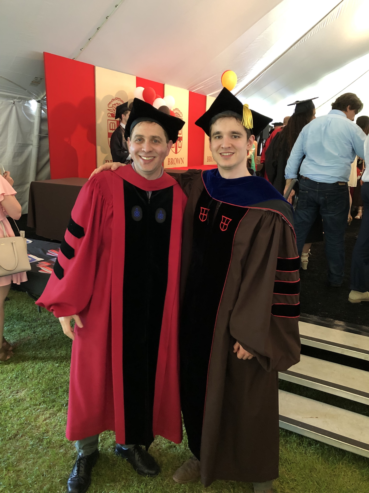
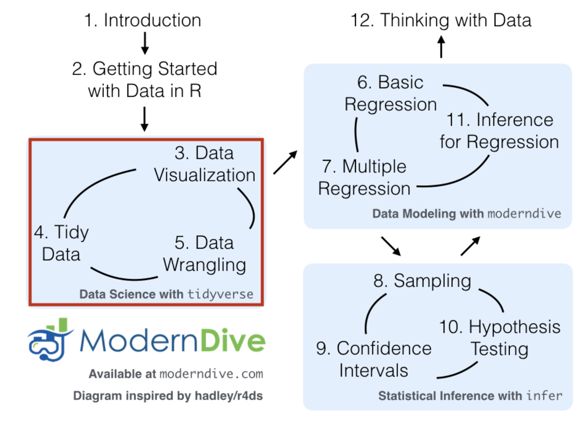

```{r xaringan-themer, include = FALSE}
library(xaringanthemer)
mono_accent(base_color = "#43418A")
```

```{r, include = FALSE}
library(plyr)
library(tidyverse)
library(moderndive)
library(infer)
```

<!--
pagedown::chrome_print("~/Dropbox/Teaching/02-Brown Courses/CEMA0928-Statistics in the Real World [ONLINE]/Content/01-Introduction/01p01-Introduction.html")
-->

class: center, middle

# A Case Study

---

# Sarah the chimp

.pull-left[
- In 1978, researchers Premack and Woodruff published a study in *Science* magazine, reporting an experiment where an adult chimpanzee named Sarah was shown videotapes of eight different scenarios of a human being faced with a problem.

- After each videotape showing, she was presented with two photographs, one of which depicted a possible solution to the problem.

- Sarah could pick the photograph with the correct solution for seven of the eight problems!
]

.pull-right[

]

---

# How?!

What are **two possible explanations** for Sarah getting 7 correct answers out of 8?

--

1. Sarah was just guessing and got lucky. 

2. Sarah can do better than just guessing. 

--

**Which explanation do you think is better?**

--

- I think explanation (1) is better. How can you convince me that (1) is *not* the better explanation?

---

# Refuting Explanation (1)

Let's try to look at what Sarah's results would be, **if she just guessed**. 

- What is a simple way to *model* guessing between two choices?

--
.center[
```{r, echo = FALSE, out.width = "25%"}
knitr::include_graphics("coin_flip.png")
```
]
--

Let's define "heads" as a *correct answer* and "tails" as an *incorrect answer*. 

- If Sarah were just guessing ("flipping a coin"), what would be the **expected** number of correct guesses ("heads")?

---

# Simulating Guessing

If Sarah were just guessing, we would *expect* the number of correct guesses to be 4. 

- However, not every set of 8 coin tosses will result in 4 heads. 

- Let's repeat the set of 8 coin tosses many times, to generate the pattern for correct answers that could happen in the long run, **under the assumption that Sarah is just guessing**. 

--
.center[
```{r, echo = F, message = F, warning = F, out.width = "45%"}
obs.data <- c(rep("correct", 7), rep("incorrect", 1)) %>%
  as_data_frame() %>%
  rename(guess = value)

obs.data %>%
  specify(response = guess, success = "correct") %>% 
  hypothesize(null = "point", p = 0.5) %>% 
  generate(reps = 1000) %>% 
  calculate(stat = "prop") %>%
  visualize(obs_stat = 7/8, direction = "right") +
  labs(x = "Proportion of correct answers", y = "Count") +
  ggtitle("")
```
]

---

# What do you notice?

The **distribution** of the rate of correct answers, **under the assumption that Sarah was guessing**, is centered at 0.50 (50%, or 4 correct answers out of 8). 

- The red line indicates the **observed proportion** of correct answers, 7 out of 8 (87.5%). 

The majority of the distribution lies between 0.25 and 0.75. 

- This means that, if Sarah were actually guessing, then it would be *highly unlikely* to observe 7 out of 8 correct answers. 

- Thus, we are fairly convinced that Sarah is doing better than just guessing. 

--

**What if Sarah got 5 correct answers out of 8 instead?** Would we still be convinced of Sarah's ability to do better than guessing?

---

# SPOILER ALERT!!!

We just conducted a **statistical hypothesis test**, and this will be the last topic covered in Statistics in the Real World. 

Let's start from the beginning...

---

class: center, middle

# Course Introductions

---

# Who am I?

.pull-left[
- Asst. Prof of Statistics
    - Simmons University

- Website: [https://scotinastats.rbind.io/](https://scotinastats.rbind.io/)

- Ph.D. (Biostatistics), Brown U
    - M.S. (Statistics), UMass
    
    - B.A. (Math, Psychology), Holy Cross
    
- Hobbies include **R**. That's it. 
]

.pull-right[
```{r, echo = FALSE}

```
]


---

# Where are you?

Statistics in the Real World!

**Some information**

- Our textbook:
    - **ModernDive**: Statistical Inference via Data Science
    - Webpage: [https://moderndive.com](https://moderndive.com)
    - Completing the assigned readings is **crucial**!!!
    
- See the **Syllabus** on Canvas for more information!

---

# ModernDive 

.center[
```{r, echo = FALSE, out.width = "65%"}
knitr::include_graphics("md_mobile.png")
```
]

---

class: center, middle

# Introduction

---

# Course Objectives

- Learn how to answer scientific questions with **data**. 

.center[
```{r, echo = FALSE}
knitr::include_graphics("ds_pipeline.png")
```
]

- Statistics isn't just a bunch of numbers and math. We will aim to cover the entire **data science pipeline** in this course. 

---

# Course Objectives

In order to foster a conceptual understanding of statistics, use **real data** whenever possible.

**How can we do this?**

- Two engines:
    1. Mathematics: formulas, approximations, probability theory, etc.
    2. Computing: simulations, random number generating, etc.
  

- In *this* class:
    - Less of (1)
    - More of (2)


---

# The "Engine"

.center[
```{r, echo = FALSE, out.width = "50%"}

```
]

---

class: center, middle

# Introduction to R

---

# Using R Studio

After **downloading R/RStudio** or opening **RStudio Cloud**:

1. Open **R Studio** (never open **R**). 

2. In the menu bar at the top of your screen: **File** -- **New File** -- **New Script**

.center[
```{r, echo = FALSE, out.width = "75%"}
knitr::include_graphics("r-window.png")
```
]

---

# The R Studio Window

.center[
```{r, echo = FALSE, out.width = "50%"}
knitr::include_graphics("r-window.png")
```
]

**The Four Panels**:

1. **Console** (bottom-left): This is where you can perform simple calculations or run/execute commands. 
    - Either type code directly into the console, or run from a the *editor*...
2. **Editor** (top-left): This is where you can save and edit *R code* and *text* into a **script** or **R Markdown files**.
    - Save all of your code in a script (.R) or R Markdown (.Rmd) files!!!
3. **Files, Packages, Help, Plots** (bottom-right): See your files, packages, help screens, and plots (more in a few...).
4. **Environment** (top-right): Your current workspace (more in a few...).

---

# Basic Programming Concepts

**Vectors**: a series of values, created using the `c()` command. 
- Type
    ```{r, eval = FALSE, comment = ""}
    c(8, 6, 7, 5, 3, 0, 9)
    ```

    into the **console** (bottom-left) and press "Enter".
- Type 
    ```{r, eval = FALSE, comment = ""}
    c(8, 6, 7, 5, 3, 0, 9)
    ```

    into your **script** (top-left) and click "Run" *while your cursor is on the same line*.
    
Think of `c()` as standing for "*concatenate*" or "*combine*".
    
---

# Basic Programming Concepts

- Type 
    ```{r, eval = FALSE, comment = ""}
    c("Somebody", "once", "told", "me", "the", "world", "is", "gonna", "roll", "me")
    ```

    into your **script** and click "Run".
- Type 
    ```{r, echo = TRUE, eval = FALSE, comment = ""}
    c(Somebody, once, told, me, the, world, is, gonna, roll, me)
    ```

    into your **script** and click "Run". What happened?
    
--

Make sure any **character** variable (e.g., non-numerical) is surrounded by *quotation marks*! 

--

**Pro-tip**: Press [command] + [return] (Mac) while your cursor is on the same line as your code, and the line will run!

---

# Basic Programming Concepts

**Assignment**: Let's *assign* the vector `c(8, 6, 7, 5, 3, 0, 9)` to a variable, so we don't have to keep typing it out. 
- Type 
    ```{r, eval = FALSE}
    jenny = c(8, 6, 7, 5, 3, 0, 9)
    ```

    and click "Run".
    
    - **Note**: The symbol `<-` also works in place of `=`, so you can use *either* for assignment. 

--

- You might think nothing happened after that last example. But look to the **Environment** panel (top-right). 
    - Now, type 
        ```{r, eval = FALSE}
        mean(jenny)
        ```
    
        and click "Run".

---

# Arithmetic

At its core, R Studio can act as a simple calculator:
- `+` : addition
- `-` : subtraction
- `*` (shift + 8) : multiplication
- `/` : division
- `^` (shift + 6) : exponent

--

Run the following equations:
- `2+2`
- `753-342`
- `359*315`
- `118/21`
- `5^3`
- `8/2*(2+2)`
- `8/(2*(2+2))`

---

# R Packages

We will be using **R packages** extensively.
- R is *open-source*, which means that members in the community can provide additional functions, data, or documentation in a *package*. 
- Packages are *free* and can be easily downloaded. 

--

**Downloading packages in R Studio**

> **Packages** tab (bottom-right) -- **Install** -- Type package name and press *Install*

- Install the following packages (separate by a comma when typing the names):
    - `tidyverse`: suite of packages that we will use *extensively*
    - `moderndive`: package that accompanies the textbook
    - `infer`: package for statistical inference
    - `openintro`, `babynames`, `nycflights13`: packages with useful datasets
    
---

# Loading R Packages

We load R packages with the `library()` function. 
- Note that, while you only **install** packages once, you must **load** them *each time you open a new R session*. 

Run the following:
```{r, message = FALSE, warning = FALSE}
library(tidyverse)
```

Now this suite of packages (and their **dependencies**) is loaded!
    
---

# Functions

Once we define **objects**, **variables**, and/or **datasets**, much of data analysis involves applying a series of **functions** to the data. 

We have already used several functions!
- `c()`
- `mean()`
- `install.packages()` 

--

R functions typically require one or more *arguments*. 
- Some arguments are *pre-set* to **default values**. 

Run the following:
```{r, eval = FALSE}
?mean
?sum
?sqrt
```

---

# Data Frames

**Data frames**:  analogous to rectangular spreadsheets you would see in Excel or Google Spreadsheets. 

- Rows of a data frame correspond to *observations*, and columns correspond to *variables*. 

--

The `mpg` data frame (contained in the `ggplot2` package, which is part of `tidyverse`), contains fuel economy data for 38 popular car models from [http://fueleconomy.gov](http://fueleconomy.gov). 

Run the following two lines:
```{r, eval = FALSE}
library(tidyverse) # Run only if you haven't loaded this yet
mpg
```

```{r, eval = FALSE}
View(mpg)
```

---

# `mpg` Data Frame

A few notes on this dataset...

- A "tibble" is a type of data frame in R. The `mpg` data frame has:
    - 234 **rows**
    - 11 **columns**
    
- The 11 columns correspond to 11 different **variables**. Some of which are: *manufacturer*, *model*, *cty*, *hwy*, etc.

- In the console, we are shown the first 10 rows by default, since the rest can't fit on the screen. 

---

# Exploring Data

The `$` operator allows us to explore a single variable within a data frame. For example, run the following in your console:
```{r, eval = FALSE}
mpg
```

```{r, eval = FALSE}
mpg$manufacturer
```

```{r, eval = FALSE}
mpg$cty
```

- The `$` extracts only the `manufacturer` or `cty` variable from the `mpg` data frame and returns it as a **vector**. 

---

# Exploring Data

We can use the `$` operator to calculate descriptive statistics for variables within a dataset:

```{r, comment = ""}
mean(mpg$cty)
```

**What do you think `cty` means?**

--

You can get help in R by entering a `?` before the name of a function or data frame (*if it comes in an R package*), and a page will appear in the bottom-right panel. 

- Try the following:
```{r}
?mpg
```

I use the help files **all the time**, and you should too, especially if you're stuck with a specific function!

---

# Types of Variables

The object `mpg$city` is not one object, but *several*, contained within a **vector**. 

The `class()` function gives the `class` of an object (e.g., *variable types*). 
```{r}
class(mpg$cty)
```

```{r}
class(mpg$class)
```

---

# Coercion

Elements of a vector must all be of the *same type*. If we try to combine *numbers* and *characters*, strange things can happen:
```{r}
giant_glass = c(1, 800, 54, "giant")
giant_glass
class(giant_glass)
```

--

R **coerced** the data into *characters*! 
- It thinks that, because you put a *character string* in the vector, you mean for the numbers in the vector to be characters as well. 

--

Why doesn't this give a numeric answer?

```{r, eval = FALSE}
mean(giant_glass)
```

---

# Logical Vectors

Another important type of vector is a **logical** vector. These must be either `TRUE` or `FALSE`. 

Is 3 equal to 2?!
```{r}
test = (3 == 2)
test
```

Note that while `=` (and `<-`) are used for **assignment**, a double `==` is used to *test for equality*. 

--

**Example**

Before you run this, try to guess what the result will be!
```{r, eval = FALSE}
test_vec = c(3 == 2, 3 == 3, 3 < 4, 3 < 2)
test_vec
```

---

# Other Functions

`seq()` generates a *sequence* of numbers 

```{r}
# Vector:
x = c(1,2,3)

# We can also define a vector that is a sequence of numbers
y = seq(1, 10, by = 2)
y

# Combine x and y into one vector
c(x, y)
```

When `by = 1`, we can use a shortcut...

```{r}
1:10
```

---

# Indexing

In order to retrieve a *specific element* of a vector or data frame, we can use square brackets `[ ]`:
```{r}
# Retrieve the 5th element of mpg$hwy
mpg$hwy[5]

# Retrieve the 5th THROUGH 10th elements of mpg$hwy
mpg$hwy[5:10]
```

--

We can get pretty creative with indexing...

```{r}
# Retrieve only mpg$hwy ABOVE 35
mpg$hwy[mpg$hwy > 35]
```

--

**Note** (to Python users): In R indexing begins at `1`, *not* `0`. 

---

# Indexing

Of course, the previous exercise is pretty meaningless since we don't know *which cars* have good fuel economy. 
- We can index a data frame by specifying both the *row number(s)* and *column number(s)*. 

```{r, eval = FALSE}
# Access the 5th ROW across ALL columns
mpg[5, ]
```

```{r, eval = FALSE}
# Access the 5th ROW of the columns named "manufacturer" and "hwy"
mpg[5, c("manufacturer", "hwy")] 
```

```{r, eval = FALSE}
# Check which cars get more than 35 highway miles per gallon
mpg[mpg$hwy > 35, ]
```

---

class: center, middle

# R Markdown

```{r, echo = FALSE, out.width = "50%"}
knitr::include_graphics("rmarkdown_hex.png")
```

---

# R Markdown

**R Markdown** provides a way for R (and python/SQL) users to produce a single file containing code, output, and notes. 

.center[
```{r, echo = FALSE, out.width = "80%"}
knitr::include_graphics("rmarkdown.png")
```
]

Time for a **demo**! 

Click **File** -- **New File** -- **R Notebook**

---

# R Markdown Activity

Work on the following:

- Create a new folder called `CEMA0928_Notes`. 

- Save the R Markdown file you just opened to this folder as `01-Introduction_Notes`. You can either use **Save As...** from the File menu, or click on the blue disc icon in the top-left panel. 

- What do you think are the differences between the *white* blocks of text and the *gray* blocks of text?

- What happens when you click the **Knit** icon at the top of the R Markdown file?

- Create a "code chunk" similar to the one with `plot(cars)` on lines 10-12, but type `summary(cars)`. 
    - **Pro-tip**: Press [command]+[option]+[I] (Mac), or [Ctrl]+[Alt]+[I] (Windows) to create a blank code chunk!
    
---

# Chunk Options

- `echo = FALSE`: Don't *show* code

- `eval = FALSE`: Don't *evaluate* the code

- `include = FALSE`: Don't show the code or the results

- `message = FALSE`: Don't show the messages
    - This is usually relevant when you load a package but want to suppress the different "welcome" messages they might give. 
    
- `warning = FALSE`: Don't show warning messages

- `out.width = "50%"` Makes a figure half the size (you can change the percentage to fit your needs). 

In general, show your code and your results, but not your messages.

---

# What's to come?

.center[
```{r, echo = FALSE, out.width = "75%"}

```
]


