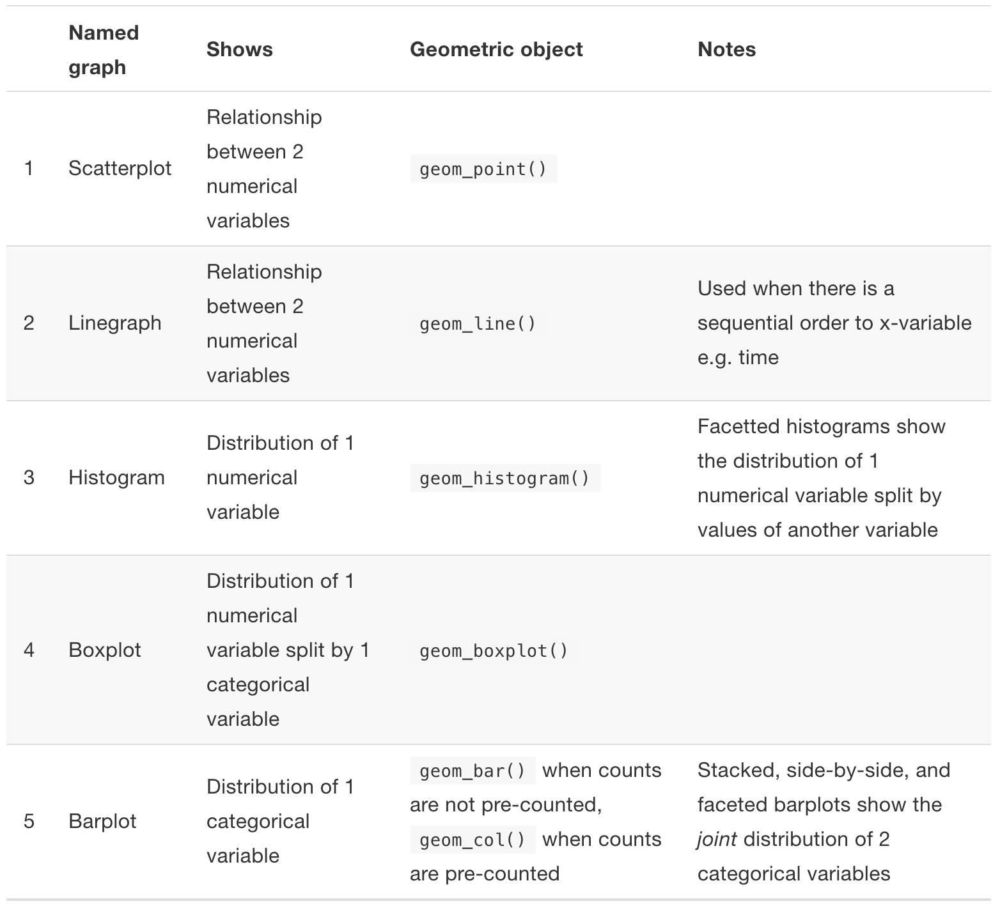

```{r xaringan-themer, include = FALSE}
library(xaringanthemer)
mono_accent(base_color = "#43418A")
```

```{r, include = FALSE}
library(tidyverse)
library(mdsr)
library(babynames)
library(ggsci)
library(nycflights13)
library(ggthemes)
```

# Needed Packages

```{r, eval = FALSE, message = FALSE, warning = FALSE}
library(nycflights13)
library(tidyverse) # Includes ggplot2
library(mdsr)
```

**Install any packages that you haven't installed yet!** 

---

# 5NG#5: Bar Plots

**Bar Plots** provide a visualization of the distribution of a *categorical variable*. 

- The x-axis shows *levels* of the categorical variable. 
- The y-axis shows the *count* of observations within each level. 

--

To illustrate bar plots, we will use the `HELPrct` dataset, which contains data from a clinical trial for adult inpatients recruited from a detoxification unit. 
- This dataset is loaded when you load the `mdsr` package. 

```{r, eval = FALSE}
View(HELPrct)
```

---

# Bar Plots

```{r, message = FALSE, warning = FALSE, dpi = 300, out.width = "50%"}
ggplot(data = HELPrct, aes(x = homeless)) + 
  geom_bar() + 
  labs(x = "") # Remove redundant x-axis label
```

---

# Stacked Bar Plots

If we map a *second categorical variable* to the `fill` **aesthetic**, we can construct **stacked bar plots**. 

```{r, message = FALSE, warning = FALSE, dpi = 300, out.width = "40%"}
ggplot(data = HELPrct, aes(x = homeless)) + 
  geom_bar(aes(fill = substance)) + 
  labs(x = "") # Remove redundant x-axis label
```

---

# Bar Plots (on proportion scale)

Add `position = "fill"` to `geom_barplot()` to convert the *y*-axis to **proportion** *out of each sub-category*.

```{r, message = FALSE, warning = FALSE, dpi = 300, out.width = "40%"}
ggplot(data = HELPrct, aes(x = homeless)) + 
  geom_bar(aes(fill = substance), position = "fill") + 
  labs(x = "", y = "Proportion") 
```

---

# Color 

Because *I know* you were wondering...

```{r, message = FALSE, warning = FALSE, dpi = 300, out.width = "40%"}
ggplot(data = HELPrct, aes(x = homeless)) + 
  geom_bar(aes(fill = substance), position = "fill") + 
  labs(x = "", y = "Proportion") +
  scale_fill_manual(values = c("dodgerblue", "chartreuse", "hotpink")) #<<
```

---

# Summary: Building plots in layers

```{r, eval = FALSE}
?mtcars
```

```{r, out.width = "50%"}
ggplot(data = mtcars, mapping = aes(x = wt, y = mpg)) 
```

---

# Summary: Building plots in layers

```{r, out.width = "50%"}
ggplot(data = mtcars, mapping = aes(x = wt, y = mpg))  + 
  geom_point()
```

---

# Summary: Building plots in layers

```{r, out.width = "50%"}
ggplot(data = mtcars, mapping = aes(x = wt, y = mpg))  + 
  geom_point(aes(color = factor(cyl)))
```

---

# Summary: Building plots in layers

```{r, out.width = "50%", message = FALSE}
ggplot(data = mtcars, mapping = aes(x = wt, y = mpg))  + 
  geom_point(aes(color = factor(cyl))) + 
  geom_smooth()
```

---

# Summary: Building plots in layers

```{r, out.width = "50%", message = FALSE}
ggplot(data = mtcars, mapping = aes(x = wt, y = mpg))  + 
  geom_point(aes(color = factor(cyl))) + 
  geom_smooth(se = FALSE, aes(color = factor(cyl)))
```

---

# Summary: Building plots in layers

```{r, out.width = "45%", message = FALSE}
ggplot(data = mtcars, mapping = aes(x = wt, y = mpg))  + 
  geom_point(aes(color = factor(cyl))) + 
  geom_smooth(se = FALSE, aes(color = factor(cyl))) + 
  labs(x="Weight (lb/1000)", y = "Miles/(US) gallon", color = "Cylinders") + 
  theme_classic()
```

---

# Summary

.center[
```{r, echo = F, eval = T, out.width = "70%"}

```
]
