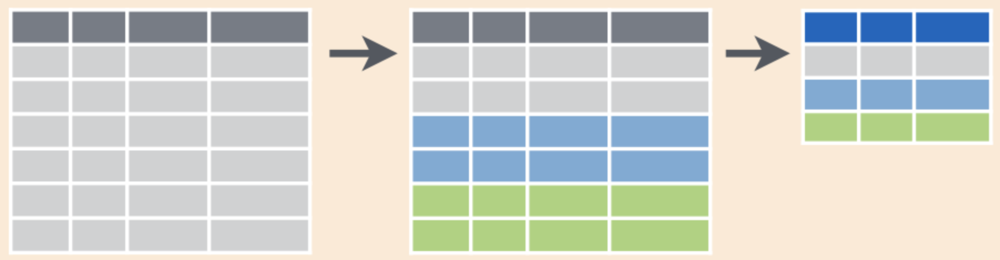

```{r xaringan-themer, include = FALSE}
library(xaringanthemer)
mono_accent(base_color = "#4682B4") #3E8A83?
```

```{r, include = FALSE}
library(plyr)
library(tidyverse)
library(moderndive)
library(infer)
library(nycflights13)
library(gapminder)
```

# Needed Packages 

```{r}
library(tidyverse) # includes ggplot2 and dplyr
library(nycflights13)
```

---

# `group_by()` rows

.center[
```{r, echo = FALSE, out.width = "70%"}

```
]

We just used `summarize()` to calculate the **mean** and **standard deviation** of New York temperature in 2013. 

- But what if we want to calculate these summary statistics *for each month*?

- We can use `group_by()` in our chain to generate *aggregate* summary statistics!

---

# `group_by()`

Before running the code below, *what do you think it does*?

```{r, eval = FALSE}
summary.temp.monthly = weather %>%
  group_by(month) %>%
  summarize(mean.temp = mean(temp, na.rm = TRUE), 
            sd.temp = sd(temp, na.rm = TRUE))
summary.temp.monthly
```

--

- Since **temperature** usually varies by *season*, or *month*, it makes sense to calculate monthly summary statistics. 

---

# `group_by()`

```{r, echo=FALSE, message = FALSE, warning = FALSE}
library(knitr)
library(kableExtra)
summary.temp.monthly = weather %>%
  group_by(month) %>%
  summarize(mean.temp = mean(temp, na.rm = TRUE), 
            sd.temp = sd(temp, na.rm = TRUE))
kable(summary.temp.monthly) %>% 
  kable_styling(font_size = ifelse(knitr:::is_latex_output(), 10, 16),
                latex_options = c("HOLD_position"))
```

---

# `group_by()`

The code on the previous slide is *identical* to the code we used when introducing `summarize()`...

- Except we added the first step `group_by(month)`, which does exactly what it sounds like: it **groups by** *month* before calculating summary statistics. 

--

**Note**: We never use the `group_by()` operation by itself. We always combine it with a function that performs a calculation, such as `summarize()`. 

For example, run the following. You'll notice that nothing really changes from the initial data frame. 
```{r, eval = FALSE}
weather %>%
  group_by(month)
```

---

# `group_by()` multiple variables

You are not limited to using `group_by()` with a single variable. 

- Before we do an example, let's examine a new data frame: `diamonds`, from the `ggplot2` package:

```{r, comment = ""}
diamonds
```

---

# `group_by()`

Suppose we want to calculate the **median** `price`, aggregated by different `cut` and `color` of diamonds. 

- To `group_by()` multiple variables, you enter each variable name separated by a comma:

```{r}
diamonds_cut_color = diamonds %>%
  group_by(cut, color) %>%
  summarize(median_price = median(price, na.rm = TRUE))
diamonds_cut_color
```

---

# Practice

Using the `flights` data frame, calculate the **mean** departure delay (`dep_delay`), *grouped by* airport (`origin`) and `month`. 

--

*Solution*

```{r, eval = FALSE}
mean.delay = flights %>% 
  group_by(origin, month) %>%
  summarize(mean.delay = mean(dep_delay, na.rm = TRUE))
View(mean.delay)
```

---

# Plots of Summary Data

`geom_col()` is one way we can construct a plot using summarized data (instead of an original data frame):

```{r, dpi = 300, out.width = "40%"}
ggplot(diamonds_cut_color, aes(x = cut, y = median_price, fill = color)) + 
  geom_col() + 
  labs(x = "Cut quality", y = "Median price (in $)")
```

