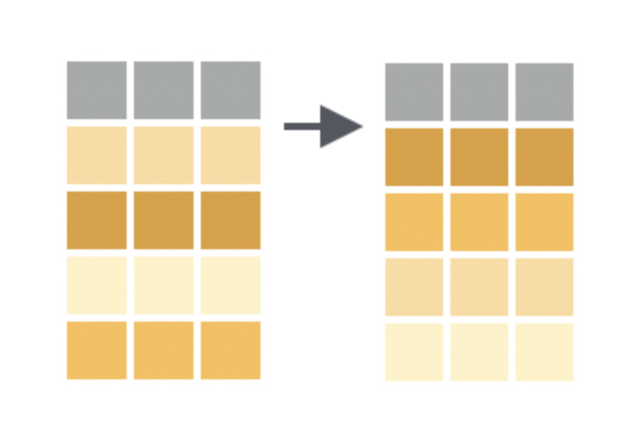
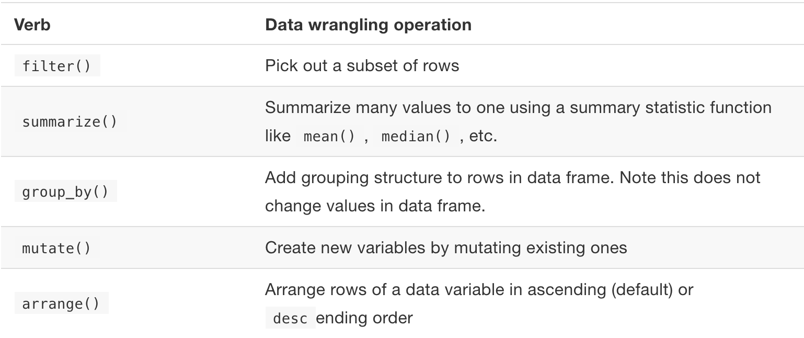

```{r xaringan-themer, include = FALSE}
library(xaringanthemer)
mono_accent(base_color = "#4682B4") #3E8A83?
```

```{r, include = FALSE}
library(plyr)
library(tidyverse)
library(moderndive)
library(infer)
library(nycflights13)
library(gapminder)
```

# Needed Packages 

```{r}
library(tidyverse) # includes ggplot2 and dplyr
library(nycflights13)
```

---

# `rename()`

`rename()` is a relatively simple `dplyr` function that, you guessed it, *renames* existing variables. 

Because we just created a variable named `temp_C` (added below for review), let's *rename* the `temp` variable to `temp_F`:
```{r}
weather = weather %>%
  mutate(temp_C = (temp - 32)/1.8) %>%
  rename(temp_F = temp)
```

- This *will* overwrite the `temp` column (unless you assign this pipeline to a name other than `weather`), but analyzing `temp.F` and `temp.C` is probably more straightforward. 

---

# `arrange()` and sort rows

.center[
```{r, echo = FALSE, out.width = "60%"}

```
]

---

# `arrange()` and sort rows

**Question**: What is the most frequent destination for flights from New York City in 2013?

- We can answer this with two functions that we already know!
    - `group_by()` destination
    - `summarize` number of rows in each group (since each row represents a flight)
    
```{r, eval = FALSE}
frequent.dest = flights %>%
  group_by(dest) %>%
  summarize(num.flights = n())
View(frequent.dest)
```

---

# `arrange()` and sort rows

While you can click on a variable name in `View()` to sort in ascending or descending order, you can also code this using `arrange()`:

```{r, eval = FALSE}
frequent.dest %>%
  arrange(num.flights)
```

**or**

```{r, eval = FALSE}
frequent.dest %>%
  arrange(desc(num.flights)) # arrange in DESCENDING order
```

---

# `arrange()`

If you use `arrange()` with a non-numerical variable, the variable is sorted alphabetically:

```{r, comment = ""}
diamonds %>%
  arrange(cut)
```

---

# `arrange()` rows

The `gapminder` data frame is currently arranged by *country*, followed by *year*. 

```{r}
head(gapminder, 5)
```

Suppose we instead would like to sort `gapminder` by *year*, followed by *country*. 

---

# `arrange()` rows

```{r}
gapminder %>%
  arrange(year, country)
```

---

# `arrange()` rows (in descending order)

By default, `arrange()` will sort rows in **ascending order** (least to greatest, or *alphabetically*) based on the column(s) specified. 

- To sort in **descending order**, use `desc()` around any of the variables specified in `arrange()`. 

--

Let's take *only data from 2007* and sort by the *largest to smallest* life expectancy:

```{r, eval = FALSE}
gapminder %>%
  filter(year == 2007) %>%
  arrange(desc(lifeExp)) 
```

---

# Summary

.center[
```{r, echo = F, eval = T}

```
]
