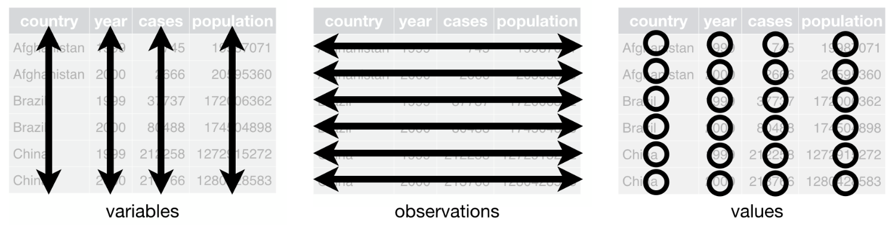

<!--
pagedown::chrome_print("~/Dropbox/Teaching/02-Brown Courses/CEMA0928-Statistics in the Real World [ONLINE]/Content/04-Tidy_Data/04-Tidy_Data.html")
-->


```{r xaringan-themer, include = FALSE}
library(xaringanthemer)
mono_accent(base_color = "#4682B4") #3E8A83?
```

```{r, include = FALSE}
library(tidyverse)
library(fivethirtyeight)
```

# Needed Packages 

```{r}
library(tidyverse) # includes tidyr
library(fivethirtyeight)
```

---

# `bush_approval` data

Download the `bush_approval` data from Canvas, and import it into R. 

```{r, echo = FALSE, message = FALSE, warning = FALSE}
bush_approval <- read_csv("~/Dropbox/Teaching/02-Brown Courses/CEMA0928-Statistics in the Real World [ONLINE]/Data/bush_approval.csv")
```

The `bush_approval` data frame consists of approval ratings (out of 100%) of former US President George W. Bush. 

- `date`: date of poll
- `Approve`: overall percent who approve of President Bush
- `Disapprove`: overall percent who disapprove of President Bush
- `Republican`: percent approval among Republican voters
- `Independent`: percent approval among Independent voters
- `Democrat`: percent approval among Democrat voters
- `Pres.Party`: President Bush's political party

--

Simplify the data a bit:
```{r}
bush_approval = bush_approval %>%
  select(date, Republican, Independent, Democrat)
```

---

# Wide Data

```{r}
head(bush_approval, 5)
```

The `bush_approval` data are currently in **wide format**. 

- Each party's approval of Bush is located in a separate column. 

--

If *visual inspection* is the primary analytical technique, this format can be convenient. 

- However, it can be more difficult to implement anything other than *visual inspection*. 

---

# Tidy Data

As is, the `bush_approval` data are not **tidy**!

--

```{r, echo = FALSE, eval = TRUE}

```

From [Wickham (2014)](https://vita.had.co.nz/papers/tidy-data.pdf)
  
1. Each variable forms a column.

2. Each observation forms a row.

3. Each type of observational unit forms a table.

---

# Tidy Data

Why is `bush_approval` *not* tidy?

```{r, comment = ""}
head(bush_approval, 5)
```

What are the **three unique pieces of information** in this data frame?

--

1. Date
2. Approval Rating
3. Political Party

--

But... there are more than three columns!

---

# Tidy Data

We want to end up with this:

```{r, echo = FALSE}
bush_tidy = bush_approval %>%
  pivot_longer(names_to = "Party", 
               values_to = "Approval", 
               cols = -date)
```
```{r, comment = ""}
bush_tidy
```

---

# How do we convert to "tidy" data?

.center[
```{r, echo = F, eval = T, out.width = "40%", dpi = 300}
knitr::include_graphics("tidyr_hex.png")
```
]

---

# `pivot_longer()`

We convert a data frame to "tidy" (long format) by using the `pivot_longer()` function from the `tidyr` package.

- The `tidyr` package loads with the `tidyverse`. 

```{r}
head(bush_approval, 5)
```

```{r, echo = TRUE, eval = FALSE}
bush_tidy = bush_approval %>%
  pivot_longer(names_to = "Party", 
               values_to = "Approval", 
               cols = -date)
```

---

# `pivot_longer()`

```{r, comment = ""}
bush_tidy = bush_approval %>%
  pivot_longer(names_to = "Party", 
               values_to = "Approval", 
               cols = -date)
bush_tidy
```

---

# `pivot_longer()`

The `pivot_longer()` function takes the following *arguments*:

- `names_to` is the name of the column/variable in the new "tidy" frame that contains the column names of the original data frame that you want to tidy.
    - When we set `names_to = Party`, the `Party` column in `bush_tidy` contains the original Party names from `bush_approval`. 

--

- `values_to` is the name of the column/variable in the "tidy" frame that contains the rows and columns of values in the original data frame you want to tidy. 
    - When we set `values_to = Approval`, the `Approval` column in `bush_tidy` contains all of the approval ratings from `bush_approval`. 

--

- The third argument, `cols`, is the column(s) you either want to or don’t want to tidy. 
    - The `date` variable was already tidy, so we didn't need to further modify it. 
    
---

# Benefits of Tidy Data

While we sacrificed our ability to see the data *all at once*, it is much more straightforward to use *data visualization* and *data wrangling* techniques with **tidy data**. 

```{r, dpi = 300, out.width = "40%"}
ggplot(data = bush_tidy, aes(x = date, y = Approval, color = Party)) + 
  geom_line(size = 1.5) + 
  labs(x = "", title = "Approval Rate for George W. Bush", subtitle = "by party")
```

---

# Going from tidy to wide format

If you have a *tidy* dataset but want to transform it to *wide format*, use the `pivot_wider()` function:

```{r}
bush_wide = bush_tidy %>%
  pivot_wider(names_from = "Party", 
              values_from = "Approval")
head(bush_wide, 5)
```

The `pivot_wider()` syntax is nearly *identical* to `pivot_longer()`, except with the `names_from` and `values_from` arguments. 

---

# Example

Let's look at the `drinks` data frame from the `fivethirtyeight` package. 

```{r, comment = ""}
library(fivethirtyeight)
drinks
```

---

# Example

```{r, echo = FALSE, out.width = "50%"}

```

---

# Example

Run the following code to simplify the data frame a bit:

```{r, eval = FALSE}
drinks_smaller = drinks %>%
  filter(country %in% c("USA", "France", "China", "Italy", "Ireland")) %>%
  select(-total_litres_of_pure_alcohol)
View(drinks_smaller)
```

```{r, echo = FALSE, comment = ""}
drinks_smaller = drinks %>%
  filter(country %in% c("USA", "France", "China", "Italy", "Ireland")) %>%
  select(-total_litres_of_pure_alcohol)
drinks_smaller
```

---

# Practice

Convert `drinks_smaller` to a **tidy** data frame. 

**Starting Point**
```{r, comment = ""}
drinks_smaller
```

---

# Practice

Convert `drinks_smaller` to a **tidy** data frame. 

**Ending Point**
```{r, echo = FALSE, eval = TRUE}
drinks_tidy = drinks_smaller %>%
  gather(key = type, value = servings, -country)
```
```{r, comment = ""}
drinks_tidy
```
