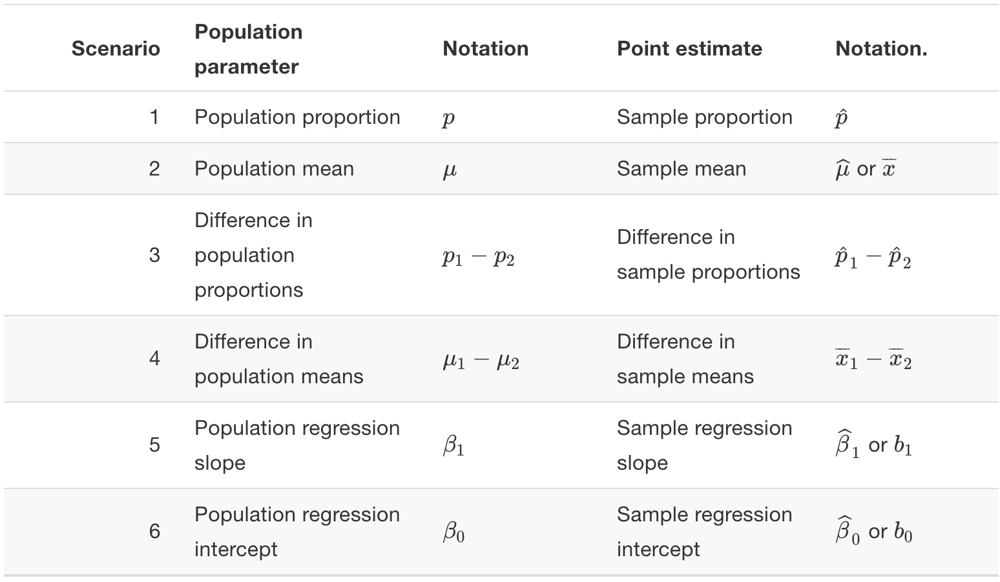
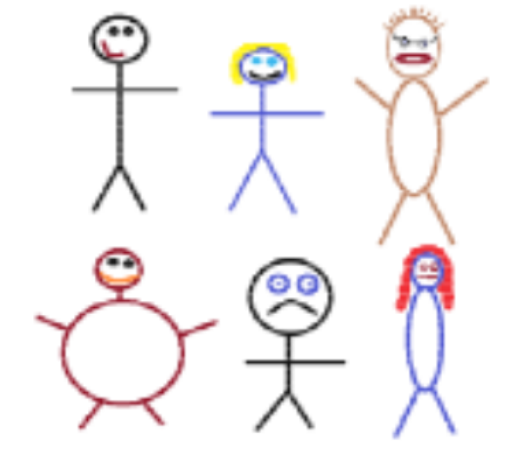
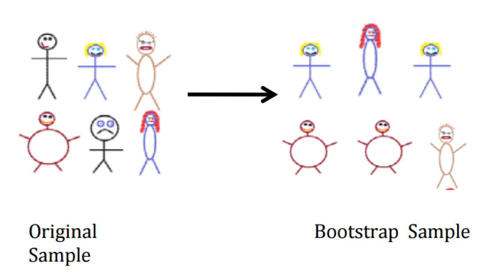

```{r xaringan-themer, include = FALSE}
library(xaringanthemer)
mono_accent(base_color = "#43418A")
```

```{r, include = FALSE}
library(tidyverse)
library(moderndive)
library(infer)
```

class: center, middle

# Introduction

---

# Recap

If *sampling* of a sample of size $n$ is done at **random**, then the resulting sample is *unbiased* and **representative** of the **population**. 
- Thus, the **sample statistic** from the representative sample represents a "good guess" of the (unknown) **population parameter**. 

--

Using the `bowl` data frame in the `moderndive` R package, we used the **sample proportion**, $\hat{p}$, to estimate the **population proportion**, $p$. 

Generally, we will use the *sample* to **infer** about the *population*. 

---

# Notation Summary

```{r, echo = FALSE}

```

---

# In reality...

In *most cases*, we don't have the population values like we did with the `bowl` data frame, and we don't take many samples from the population. 
- We only have a single sample of data from a larger population!

--

While the **sample statistic** represents our single *best guess* at the (unknown) **population parameter**, we would also like to create a *range of plausible values* for the population paramter. 
- This range is called a **confidence interval**. 

--

How do we use a single sample to get some idea of how other samples might vary in terms of their statistic values?
- **Bootstrapping**

---

# Needed Packages 

```{r}
library(tidyverse)
library(moderndive)
library(infer)
```

---

class: center, middle

# Bootstrapping

---

# `pennies_sample`

```{r, comment = ""}
pennies_sample
```

--

**Question**: What is the *average year* on US pennies in 2019?
- Can we use the sample of 40 pennies to help answer this question?

---

# Exploratory Data Analysis: Data Visualization

Because the variable of interest, `year`, is **numerical**, we can plot a **histogram** to visualize the distribution of the 40 pennies. 
```{r, out.width = "35%"}
ggplot(data = pennies_sample, mapping = aes(x = year)) + 
  geom_histogram(color = "white", binwidth = 5)
```

---

# Exploratory Data Analysis: Data Visualization

.pull-left[
```{r, echo = FALSE}
ggplot(data = pennies_sample, mapping = aes(x = year)) + 
  geom_histogram(color = "white", binwidth = 5)
```
]

.pull-right[
Most of the ages are near 20 years. 

- If this sample is **representative** of the population of US pennies, we would expect the distribution of *all* pennies' years to have a similar shape. 
]

---

#Exploratory Data Analysis: Summary Statistics

Because we are interested in the **mean** age of *all* US pennies, let's calculate the **sample mean**, $\bar{x}$, of our 40 pennies using `summarize()`:
```{r, comment = ""}
x_bar = pennies_sample %>%
  summarize(stat = mean(year))
x_bar
```

--

Therefore, our **point estimate** is $\bar{x}=1995$. This represents our *best guess* at the **population mean** year on all US pennies in 2019, $\mu$. 

---

# The Point Estimate

The point estimate of $\bar{x}=1995$ represents a single guess at $\mu$. But what if we'd like another guess?
- For example, using the `bowl` data frame, we took *many samples* and calculated *many sample proportions*. 
- Can we do that here?

--

**No**, because we only have a single sample and *no population data*!

--

Luckily, **bootstrapping** allows us to use a *single sample* to generate many different samples that will act as our way of approximating a sampling distribution using a created **bootstrap distribution**. 

---

# Sampling Variability

**Why are we interested in this?**

*Every* **sample statistic** has some variability. 
- Suppose you take a random sample of 50 Summer@Brown students and five are left-handed. 

--

If you take a *different* random sample of 50 Summer@Brown students, how many would you *expect* to be left-handed?
- Suppose three are left-handed. Is that surprising?
- Would 40 left-handed students out of 50 be surprising?

**Two ways to measure variability**:

1. Theory (Central Limit Theorem, etc.)
2. **Simulation** (e.g., *bootstrapping*)

---

# The Bootstrapping Process

Bootstrapping uses a process of sampling **with replacement** from our original sample to create new bootstrap samples of the **same size** as our original sample.

We can generate a *single bootstrap sample* by using the `rep_sample_n()` function from earlier:
```{r, echo = FALSE}
set.seed(12)
```

```{r, comment = ""}
bootstrap_sample1 = pennies_sample %>%
  rep_sample_n(size = 40, reps = 1, replace = TRUE)
```

--

- Notice that `size=40`. This *isn't an arbitrary number*. When bootstrapping, the `size` value will *always be the same as the original sample size*!
- We add a new argument to `rep_sample_n()`, `replace = TRUE`. This means that when a penny is selected for our **bootstrap sample**, it has the chance to be selected *again*. 

---

# Why bootstrap?

Ideally, you are able to take thousands of samples from the same population and obtain an estimate (close to) an *exact* population parameter, and know exactly how much each sample **varies**. 
- **Example**: Taking many samples of red and white balls from a bowl of 2,400 balls

--

But this is **impossible**!
- So we *improvise* and copy our sample many times to **simulate** a population. 

---

# Practice

Using your **bootstrap sample**, perform the following:
- Construct a histogram of `year`. 
- Calculate the sample mean of `year`. 

*Hint*: These are identical calculations to the ones we performed earlier, we are just using the `bootstrap_sample1` data frame here. 

---

# Solution

```{r, out.width = "30%"}
ggplot(data = bootstrap_sample1, mapping = aes(x = year)) + 
  geom_histogram(color = "white", binwidth = 5)
```

```{r, comment = ""}
bootstrap_sample1 %>%
  summarize(stat = mean(year))
```

---

# The Bootstrapping Process

Suppose we have a **random sample** of $n=6$ people. 

.center[
```{r, echo = FALSE, out.width = "40%"}

```
]

---

# The Bootstrap Sample

**Bootstrap sample**: Sample *with replacement* from the original sample, using the *same sample size*. 

.center[
```{r, echo = FALSE, out.width = "80%"}

```
]

---

# A Note on Sampling with Replacement

The process of **sampling with replacement** is how we can use the original sample to take a guess as to what other values in the population may be.
- In the `pennies_sample` data frame, most of the `year` values are near 1995. Therefore, these values have a greater chance of being selected in the **bootstrap sample**. 

---

# Taking 6 Bootstrap Samples

You are not limited to a single bootstrap sample. You will likely need *many bootstrap samples* to better understand the variation in pennies' ages between samples. 

Let's take 6 bootstrap samples (using `reps = 6` in `rep_sample_n()`), construct histograms, and generate sample means (**bootstrap statistics**):

```{r}
six_bootstrap_samples = pennies_sample %>% 
  rep_sample_n(size = 40, reps = 6, replace = TRUE)
```

---

# Taking 6 Bootstrap Samples

```{r, out.width = "50%"}
ggplot(data = six_bootstrap_samples, mapping = aes(x = year)) + 
  geom_histogram(color = "white", binwidth = 5) + 
  facet_wrap( ~ replicate)
```

---

# Taking 6 Bootstrap Samples

```{r, comment = ""}
six_bootstrap_samples %>%
  group_by(replicate) %>%
  summarize(stat = mean(year))
```

--

Do you think 6 bootstrap samples is enough?
- We *should* take many more samples, such as 1,000!

Luckily there is a package made specifically to help with this kind of thing: `infer`