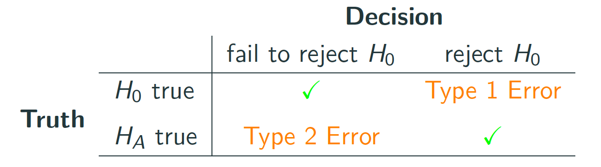
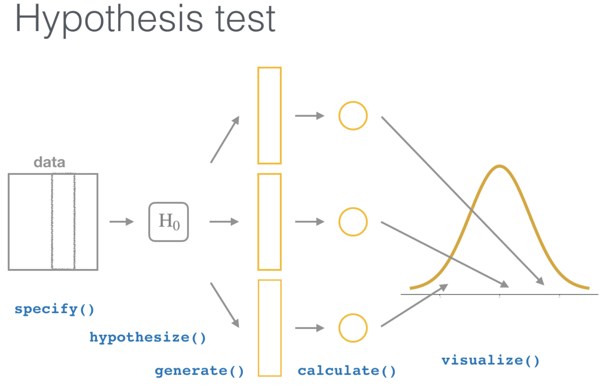
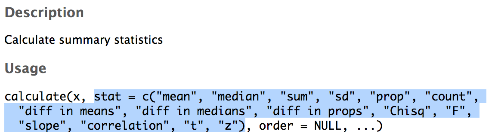
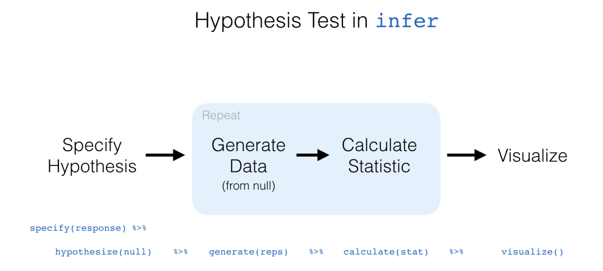

<!--
pagedown::chrome_print("~/Dropbox/Teaching/02-Brown Courses/CEMA0928-Statistics in the Real World [ONLINE]/Content/09-Hypothesis_Testing/09p05-Hypothesis_Testing.html")
-->

```{r xaringan-themer, include = FALSE}
library(xaringanthemer)
mono_accent(base_color = "#43418A")
```

```{r, echo = FALSE}
knitr::opts_chunk$set(
  message = FALSE, warning = FALSE
)
```

```{r, include = FALSE}
library(tidyverse)
library(infer)
library(nycflights13)
library(ggplot2movies)
library(broom)
```

# Needed Packages 

```{r}
library(tidyverse)
library(infer)
library(nycflights13)
```

---

class: center, middle

# When inference is not needed

---

# Back to the `flights` data frame

Sometimes, it isn't necessary to perform a statistical hypothesis test. 
- *Always* do **exploratory data analysis**!

--

```{r, eval = FALSE}
View(flights)
```

---

# Average Flight Times 

Assuming two flights leave from New York, which do you think is longer?
- The flight to **Boston**?
- The flight to **San Francisco**?

--

```{r}
bos_sfo = flights %>%
  na.omit() %>% # removes flights with missing info
  filter(dest %in% c("BOS", "SFO")) 
```

---

# Exploratory Data Analysis: Summary Statistics

```{r, comment = ""}
bos_sfo %>%
  group_by(dest) %>%
  summarize(mean = mean(air_time), sd = sd(air_time))
```

---

# Exploratory Data Analysis: Data Visualization

```{r, out.width = "45%"}
ggplot(data = bos_sfo, mapping = aes(x = dest, y = air_time)) + 
  geom_boxplot()
```

---

# Summary

There is *no overlap at all* in the boxplots!
- This means that the air time for San Francisco flights is **statistically greater** than the air time for Boston flights (which isn't surprising). 

The procedures that follow *would not be necessary* for data such as these. 
- Always do **exploratory data analysis**!!!

---

class: center, middle

# Basics of Hypothesis Testing

---

# Hypothesis Tests

In a statistical **hypothesis test**, we use *sample data* to help us decide between two competing hypotheses about a *population parameter*. 
- The **null hypothesis** 
    - $H_{0}$
- The **alternative hypothesis**
    - $H_{a}$

--

The **alternative hypothesis** is the claim for which we seek significant evidence. 
- **Example**: Are the flight times for flights from NY to BOS or SFO *significantly different*?

--

The **null hypothesis** is usually a claim of *no effect* or *no difference*. 
- **Example**: There is *no difference* in the flight times from NY to BOS or SFO. 

---

# Assessing Strength of Evidence

First, we *assume that the null hypothesis is true*. 
- Then, we determine *how unlikely* it would be to observe **sample statistics** as extreme (or more extreme) than the ones in the original sample. 

--

**Don't worry!** This might not sound immediately straightforward. 
- Seasoned scientists often misunderstand statistical hypothesis tests. 

--

**Criminal trial analogy**: *Innocent until proven guilty*

---

# Two Possible Conclusions

These are the *only two* possible conclusions to a statistical hypothesis test:

- **Reject** the null hypothesis $H_{0}$ $\rightarrow$ **Accept** the alternative hypothesis $H_{a}$ 
- **Fail to reject** the null hypothesis $H_{0}$

Therefore, *never* write "Accept $H_{0}$" when you mean "Fail to reject $H_{0}$!"

---

# Types of Errors

Hypothesis tests *are not perfect*. Unfortunately, there exists the possibility of your conclusion being *incorrect*. 

--

Similar to a criminal trial:
- an *innocent* person is wrongly convicted (found guilty), or
- a *guilty* person is wrongly set free (found not guilty)

---

# Types of Errors

Let's assume the following: 
$$H_{0}: \text{person is innocent},\ H_{a}: \text{person is guilty}$$

The two **errors** are:
- Reject $H_{0}$ when $H_{0}$ is true (**Type I Error**)
- Fail to reject $H_{0}$ when $H_{0}$ is false (**Type II Error**)

--

When you use a *sample* to make inferences about a *population*, there is a chance that your inferences are incorrect!
- With any procedure, there is a chance of Type I Error and a chance of Type II Error. 

---

# Type I and Type II Errors

.center[
```{r, echo = FALSE, out.width = "80%"}

```
]

Of course, we want a *small probability* of making an error!

--

- The probability of Type I Error is denoted by $\alpha$ ("alpha") and is called the **significance level** of the hypothesis test. 
- The probability of Type II Error is denoted by $\beta$ ("beta").

---

# Significance Level

We want $\alpha$ and $\beta$ as close to 0 as possible, because this would minimize our chance of making an error in our hypothesis test conclusions. 

Usually, we set $\alpha$ (the **significance level**) before the hypothesis test is conducted. 
- We then judge the "evidence" against $\alpha$. 

--

Common values of $\alpha$ are $0.05$, $0.01$, and $0.10$. 
- If we set $\alpha=0.05$, this means that we are using a procedure that, when used *over and over with different samples*, rejects a TRUE $H_{0}$ 5% of the time. 

---

# Statistical Significance

The results from a hypothesis test are **statistically significant** if they are *more extreme* than what we would expect to see by random chance, **if the null hypothesis were true**. 
- In other words, we have *convincing evidence* in favor of the alternative hypothesis, allowing us to generalize our *sample* results to the claim about the *population*. 

--

**Example**: Back to Sarah the chimp...

---

# Sarah the chimp

.pull-left[
- In 1978, researchers Premack and Woodruff published a study in *Science* magazine, reporting an experiment where an adult chimpanzee named Sarah was shown videotapes of eight different scenarios of a human being faced with a problem.

- After each videotape showing, she was presented with two photographs, one of which depicted a possible solution to the problem.

- Sarah could pick the photograph with the correct solution for seven of the eight problems!
]

.pull-right[

]

---

# How?!

What are **two possible explanations** for Sarah getting 7 correct answers out of 8?

--

1. Sarah was just guessing and got lucky. 

2. Sarah can do better than just guessing. 

--

Explanation 1 is the **null hypothesis**. Is there enough evidence to reject the explanation that Sarah was *guessing*?

---

# Simulating Guessing

If Sarah were just guessing, we would *expect* the number of correct guesses to be 4. 

- However, not every set of 8 coin tosses will result in 4 heads. 

- Let's repeat the set of 8 coin tosses many times, to generate the pattern for correct answers that could happen in the long run, **under the assumption that Sarah is just guessing**. 

--
.center[
```{r, echo = F, message = F, warning = F, out.width = "45%"}
obs.data <- c(rep("correct", 7), rep("incorrect", 1)) %>%
  as_data_frame() %>%
  rename(guess = value)

obs.data %>%
  specify(response = guess, success = "correct") %>% 
  hypothesize(null = "point", p = 0.5) %>% 
  generate(reps = 1000) %>% 
  calculate(stat = "prop") %>%
  visualize(obs_stat = 7/8, direction = "right") +
  labs(x = "Proportion of correct answers", y = "Count") +
  ggtitle("")
```
]

---

class: center, middle

# Hypothesis Testing in R

---

# `infer`

.center[
```{r, echo = FALSE}

```
]

---

# `hypothesize()`

You have seen most of these `infer` package functions when we constructed **confidence intervals**. 
- Confidence intervals are *closely related* to hypothesis tests!

The only new verb-named fucntion here is `hypothesize()`:
- Its main argument is `null`, which is either:
    - `point` for hypotheses involving a *single sample*
    - `independence` for hypotheses involving a *comparison between groups*
    
---

# Comparing Two Means

First we will build hypotheses which look at the **difference between two population means**. 

Recall that $\mu$ ("mu") denotes a single population mean. 
- When we have *two groups*... 
    - Let $\mu_{1}$ be the population mean of group 1. 
    - Let $\mu_{2}$ be the population mean of group 2. 
    
--

**Two competing hypotheses**

$H_{0}$: $\mu_{1}=\mu_{2}$ (The population means are equivalent between groups.)

$H_{a}$: $\mu_{1}\neq \mu_{2}$ (or $<$, $>$ depending on the context)

---

# Action vs. Romance Movies

The `movies_sample` dataset contains a sample of 200 *action* and *romance* movies, along with their title, year of release, and IMDB.com rating. 

```{r, echo = FALSE, message = FALSE}
movies_sample = readr::read_csv("movies_sample.csv")
```

```{r, comment = ""}
movies_sample
```

---

# Action vs. Romance Movies

**Question**: Is there a *significant difference* in the **average movie ratings** of Action vs. Romance movies on IMDB.com?

--

Let $\mu_{a}$ denote the *population mean* rating of Action movies, and let $\mu_{r}$ denote the *population mean* rating of Romance movies. 
- $H_{0}$: $\mu_{a}=\mu_{r}$
- $H_{a}$: $\mu_{a}\neq \mu_{r}$

---

# Exploratory Data Analysis: Data Visualization

```{r, out.width = "45%"}
ggplot(data = movies_sample, mapping = aes(x = genre, y = rating)) + 
  geom_boxplot()
```

---

# Exploratory Data Analysis: Summary Statistics

Unlike the comparison in flight times between BOS and SFO destinations, it is unclear if the *average* movie rating is **significantly different** between Action and Romance movies. 

Let's calculate **summary statistics** *by group* to gather more detail:
```{r, comment = ""}
summary_stats = movies_sample %>%
  group_by(genre) %>%
  summarize(mean = mean(rating), sd = sd(rating))
summary_stats
```

---

# Exploratory Data Analysis: Summary Statistics

```{r, echo = FALSE, eval = TRUE, comment = ""}
summary_stats = movies_sample %>%
  group_by(genre) %>%
  summarize(mean = mean(rating), sd = sd(rating))
summary_stats
```

Since we are interested in inference about the **difference between means**, our *sample statistic* will be the **difference between sample means**. 
- $\bar{x}_{r}=6.19$ and $\bar{x}_{a}=5.04$, so $\bar{x}_{r}-\bar{x}_{a}=1.15$.

---

# Observed Effect

Another way of writing the sample statistic in hypothesis testing is to call it the **observed effect**, $\delta^{*}$ ("delta star"). 

There is a more convenient way of calculating this in R, using the `infer` package:
```{r, comment = ""}
obs_diff = movies_sample %>% 
  specify(formula = rating ~ genre) %>% #<<
  calculate(stat = "diff in means", order = c("Romance", "Action"))
obs_diff
```

- Recall the `specify()` and `calculate()` functions from earlier. 

---

# Simulating the Null Hypothesis

Now that we calculated the **sample statistic** (or the *observed effect*), the next step in a statistical hypothesis test is to simulate a world where the **null hypothesis is true**. 
- $H_{0}$: $\mu_{a}=\mu_{r}$, or $\mu_{r}-\mu_{a}=0$

We can *simulate* this using `generate()`. 

---

# Simulating the Null Hypothesis

If we *assume* that the population mean rating is **equal** between Action and Romance movies, then assuming $H_{0}$ true is equivalent to taking all 200 ratings and *randomly re-shuffling* (**randomizing**) them into the Action and Romance groups. 
- If $H_{0}$ is true, then there is no association between `genre` and `rating`, so each rating is *equally likely* to appear in either group. 

--

This is the framework that `generate()` follows.

```{r, echo = FALSE}
set.seed(12)
```

```{r, comment = "", message = FALSE}
movies_sample %>% 
  specify(formula = rating ~ genre) %>%
  hypothesize(null = "independence") %>% 
  generate(reps = 1) %>% 
  calculate(stat = "diff in means", order = c("Romance", "Action"))
```

---

# Simulating the Null Hypothesis

```{r, echo = FALSE}
set.seed(12)
```

```{r, comment = "", message = FALSE, warning = FALSE}
movies_sample %>% 
  specify(formula = rating ~ genre) %>% #<<
  hypothesize(null = "independence") %>% #<<
  generate(reps = 1) %>% 
  calculate(stat = "diff in means", order = c("Romance", "Action"))
```

- `generate(reps = 1)` completes a single **permutation** of sending values of `ratings` to potentially different values of `genre` from which they originally came. 

--

- Similar to **bootstrapping**, we can repeat this process 5,000 times, to simulate a world where the **null hypothesis** is true. 

---

# Distribution Under the Null Hypothesis

```{r, message = FALSE, warning = FALSE}
generated_samples = movies_sample %>% 
  specify(formula = rating ~ genre) %>% 
  hypothesize(null = "independence") %>% 
  generate(reps = 5000) %>%
  calculate(stat = "diff in means", order = c("Romance", "Action"))
```

This creates a *distribution* of 5,000 **simulated** differences in sample means, called the **null distribution**.
- The **null distribution** is similar to the **bootstrap distribution** since we are just resampling from our original sample. 
- The difference here is that we are *assuming the null hypothesis is true*. 

---

# The Null Distribution

```{r, out.width = "50%", message = FALSE, warning = FALSE}
generated_samples %>%
  visualize()
```

---

# The Null Distribution

```{r, out.width = "50%", message = FALSE, warning = FALSE}
generated_samples %>%
  visualize(obs_stat = 1.15)
```

---

# Quantifying the Strength of Evidence

We are interested in seeing if our *observed* sample difference in mean movie rating between Action and Romance of 1.15 is *greater than what would be expected from random chance*. 
- What are the chances of observing a sample average difference in means of 1.15, *in a world where the population averages between genres are equal*?

How can we **quantify** these chances?
- If these chances where *small*, we could **reject the null hypothesis**. 


---

# The p-value

the **p-value** is the probability of observing a **sample statistic** as extreme (or more extreme) than the one in the original sample, *assuming the null hypothesis is true*. 

--

```{r, out.width = "40%", message = FALSE, warning = FALSE}
generated_samples %>%
  visualize(obs_stat = 1.15, direction = "both")
```

---

# The p-value

.pull-left[
```{r, echo = FALSE, eval = TRUE, message = FALSE, warning = FALSE}
generated_samples %>%
  visualize(obs_stat = 1.15, direction = "both")
```
]

.pull-right[
Our *observed* **sample difference in means** was 1.15: On average, Romance movies had a IMDB.com rating that was 1.15 higher than Action movies. 
- We mark this with a *red line*, and shade red all values at or above that value...
    - and also shaded red those values at or below its negative value. 
]

---

# The p-value

.pull-left[
```{r, echo = FALSE, eval = TRUE, message = FALSE, warning = FALSE}
generated_samples %>%
  visualize(obs_stat = 1.15, direction = "both")
```
]

.pull-right[
You can probably guess what the p-value will be for this example. 
- The red shading does not intersect the histogram at all!
]

---

# Calculating the p-value

```{r, comment = ""}
pvalue = generated_samples %>% 
  get_pvalue(obs_stat = 1.15, direction = "both")
pvalue
```

--

Assuming a 5% **level of significance**, we have evidence supporting the conclusion that the mean rating for romance movies is different from that of action movies.
- p-value $<0.05$
- In other words, we **reject the null hypothesis** and **conclude the alternative hypothesis**. 

---

```{r, echo = FALSE, warning = FALSE, message = FALSE}
movies_sample = readr::read_csv("movies_sample.csv")
summary_stats = movies_sample %>%
  group_by(genre) %>%
  summarize(mean = mean(rating), sd = sd(rating))
obs_diff = movies_sample %>% 
  specify(formula = rating ~ genre) %>% #<<
  calculate(stat = "diff in means", order = c("Romance", "Action"))
generated_samples = movies_sample %>% 
  specify(formula = rating ~ genre) %>% 
  hypothesize(null = "independence") %>% 
  generate(reps = 5000) %>%
  calculate(stat = "diff in means", order = c("Romance", "Action"))
pvalue = generated_samples %>% 
  get_pvalue(obs_stat = 1.15, direction = "both")
```


# Corresponding Confidence Interval

Recall that we also used the `infer` pipeline to generate **95% confidence intervals** for a population parameter.
- It is straightforward to calculate a confidence interval for $\mu_{r}-\mu_{a}$ using the existing `infer` pipeline. 

Here is the pipeline we *can use* to obtain the **confidence interval**:

```{r, echo = FALSE}
set.seed(12)
```

```{r, message = FALSE, comment = ""}
movies_sample %>% 
  specify(formula = rating ~ genre) %>% 
  #hypothesize(null = "independence") %>% 
  generate(reps = 5000) %>%
  calculate(stat = "diff in means", order = c("Romance", "Action")) %>% 
  get_ci()
```

---

# Corresponding Confidence Interval

```{r, echo = FALSE}
set.seed(12)
```

```{r, message = FALSE, eval = FALSE, comment = ""}
movies_sample %>% 
  specify(formula = rating ~ genre) %>% 
  #hypothesize(null = "independence") %>% 
  generate(reps = 5000) %>%
  calculate(stat = "diff in means", order = c("Romance", "Action")) %>% 
  get_ci()
```

This is almost *identical* to the hypothesis test pipeline!
- Except we can just remove or comment out (`#`) the `hypothesize()` step since we are no longer assuming the null hypothesis is true when we bootstrap. 

---

# CI Interpretation

```{r, echo = FALSE}
set.seed(12)
```

```{r, message = FALSE, comment = ""}
movies_sample %>% 
  specify(formula = rating ~ genre) %>% 
  #hypothesize(null = "independence") %>% 
  generate(reps = 5000) %>%
  calculate(stat = "diff in means", order = c("Romance", "Action")) %>% 
  get_ci()
```

- We are **95% confident** that Romance movies are rated between 0.739 and 1.55 points higher, *on average*, than Action movies on IMDB.com. 

---

# A Note on `calculate()`

You can use `calculate()` for *any* hypothesis test; not just those comparing a **difference in means**.

```{r, eval = FALSE}
?calculate
```

```{r, echo = FALSE, out.width = "80%"}

```

---

# Hypothesis Test for One Mean

Instead of comparing movie rating between groups, let's compare the overall movie rating to 5:
- $H_{0}$: $\mu=5$
- $H_{a}$: $\mu\neq 5$

--

```{r, echo = FALSE}
set.seed(12)
```

```{r, comment = "", message = FALSE, warning = FALSE}
movies_sample %>% 
  specify(formula = rating ~ NULL) %>% #<<
  hypothesize(null = "point", mu = 5) %>%  #<<
  generate(reps = 1) %>% 
  calculate(stat = "mean")
```

- `generate(reps = 1)` completes a single **bootstrap sample** of `ratings` from the *distribution* centered at 5. 

---

# Hypothesis Test for One Mean

The **observed sample mean**:
```{r, comment = ""}
x_bar = movies_sample %>%
  specify(formula = rating ~ NULL) %>%
  calculate(stat = "mean")
x_bar
```

---

# Hypothesis Test for One Mean

```{r, echo = FALSE}
set.seed(12)
```

```{r, comment = "", message = FALSE, warning = FALSE}
movies_sample %>% 
  specify(formula = rating ~ NULL) %>% 
  hypothesize(null = "point", mu = 5) %>%  
  generate(reps = 5000) %>% 
  calculate(stat = "mean") %>%
  get_p_value(obs_stat = x_bar, direction = "both")
```

---

# Summary

Here are the steps for *any* hypothesis test:

1. Calculate a **sample statistic** (or *observed effect*), $\delta^{*}$. 
    - Using `summarize()` or `skim()` with the original sample
    
2. Simulate a world where the *null hypothesis is true*. 
    - Using `generate(reps = )` and `calculate()`
    
3. `visualize()` where $\delta^{*}$ appears in the simulated world where the *null hypothesis is true*. 

4. Calculate the *probability* that $\delta^{*}$ (or something *more extreme*) could appear in this simulated world.

    - Using `get_p_value(obs_stat = , direction = )`

5. Decide if $\delta^{*}$ is **statistically significant**. 
    - Compare the p-value to 0.05, the **level of significance**. 
    
--

Also: **Don't forget to include a confidence interval!**

---

# Conclusion

```{r, echo = FALSE}

```
