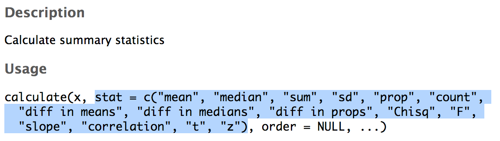

```{r xaringan-themer, include = FALSE}
library(xaringanthemer)
mono_accent(base_color = "#43418A")
```

```{r, include = FALSE}
library(tidyverse)
library(infer)
library(nycflights13)
library(ggplot2movies)
library(broom)
```

# Needed Packages 

```{r}
library(tidyverse)
library(infer)
library(nycflights13)
```

---

```{r, echo = FALSE, warning = FALSE, message = FALSE}
movies_sample = readr::read_csv("movies_sample.csv")
summary_stats = movies_sample %>%
  group_by(genre) %>%
  summarize(mean = mean(rating), sd = sd(rating))
obs_diff = movies_sample %>% 
  specify(formula = rating ~ genre) %>% #<<
  calculate(stat = "diff in means", order = c("Romance", "Action"))
generated_samples = movies_sample %>% 
  specify(formula = rating ~ genre) %>% 
  hypothesize(null = "independence") %>% 
  generate(reps = 5000) %>%
  calculate(stat = "diff in means", order = c("Romance", "Action"))
pvalue = generated_samples %>% 
  get_pvalue(obs_stat = 1.15, direction = "both")
```


# Corresponding Confidence Interval

Recall that we also used the `infer` pipeline to generate **95% confidence intervals** for a population parameter.
- It is straightforward to calculate a confidence interval for $\mu_{r}-\mu_{a}$ using the existing `infer` pipeline. 

Here is the pipeline we *can use* to obtain the **confidence interval**:

```{r, echo = FALSE}
set.seed(12)
```

```{r, message = FALSE, comment = ""}
movies_sample %>% 
  specify(formula = rating ~ genre) %>% 
  #hypothesize(null = "independence") %>% 
  generate(reps = 5000) %>%
  calculate(stat = "diff in means", order = c("Romance", "Action")) %>% 
  get_ci()
```

---

# Corresponding Confidence Interval

```{r, echo = FALSE}
set.seed(12)
```

```{r, message = FALSE, eval = FALSE, comment = ""}
movies_sample %>% 
  specify(formula = rating ~ genre) %>% 
  #hypothesize(null = "independence") %>% 
  generate(reps = 5000) %>%
  calculate(stat = "diff in means", order = c("Romance", "Action")) %>% 
  get_ci()
```

This is almost *identical* to the hypothesis test pipeline!
- Except we can just remove or comment out (`#`) the `hypothesize()` step since we are no longer assuming the null hypothesis is true when we bootstrap. 

---

# CI Interpretation

```{r, echo = FALSE}
set.seed(12)
```

```{r, message = FALSE, comment = ""}
movies_sample %>% 
  specify(formula = rating ~ genre) %>% 
  #hypothesize(null = "independence") %>% 
  generate(reps = 5000) %>%
  calculate(stat = "diff in means", order = c("Romance", "Action")) %>% 
  get_ci()
```

- We are **95% confident** that Romance movies are rated between 0.739 and 1.55 points higher, *on average*, than Action movies on IMDB.com. 

---

# A Note on `calculate()`

You can use `calculate()` for *any* hypothesis test; not just those comparing a **difference in means**.

```{r, eval = FALSE}
?calculate
```

```{r, echo = FALSE, out.width = "80%"}

```

---

# Hypothesis Test for One Mean

Instead of comparing movie rating between groups, let's compare the overall movie rating to 5:
- $H_{0}$: $\mu=5$
- $H_{a}$: $\mu\neq 5$

--

```{r, echo = FALSE}
set.seed(12)
```

```{r, comment = "", message = FALSE, warning = FALSE}
movies_sample %>% 
  specify(formula = rating ~ NULL) %>% #<<
  hypothesize(null = "point", mu = 5) %>%  #<<
  generate(reps = 1) %>% 
  calculate(stat = "mean")
```

- `generate(reps = 1)` completes a single **bootstrap sample** of `ratings` from the *distribution* centered at 5. 

---

# Hypothesis Test for One Mean

The **observed sample mean**:
```{r, comment = ""}
x_bar = movies_sample %>%
  specify(formula = rating ~ NULL) %>%
  calculate(stat = "mean")
x_bar
```

---

# Hypothesis Test for One Mean

```{r, echo = FALSE}
set.seed(12)
```

```{r, comment = "", message = FALSE, warning = FALSE}
movies_sample %>% 
  specify(formula = rating ~ NULL) %>% 
  hypothesize(null = "point", mu = 5) %>%  
  generate(reps = 5000) %>% 
  calculate(stat = "mean") %>%
  get_p_value(obs_stat = x_bar, direction = "both")
```

---

# Summary

Here are the steps for *any* hypothesis test:

1. Calculate a **sample statistic** (or *observed effect*), $\delta^{*}$. 
    - Using `summarize()` or `skim()` with the original sample
    
2. Simulate a world where the *null hypothesis is true*. 
    - Using `generate(reps = )` and `calculate()`
    
3. `visualize()` where $\delta^{*}$ appears in the simulated world where the *null hypothesis is true*. 

4. Calculate the *probability* that $\delta^{*}$ (or something *more extreme*) could appear in this simulated world.

    - Using `get_p_value(obs_stat = , direction = )`

5. Decide if $\delta^{*}$ is **statistically significant**. 
    - Compare the p-value to 0.05, the **level of significance**. 
    
--

Also: **Don't forget to include a confidence interval!**

---

# Conclusion

```{r, echo = FALSE}
knitr::include_graphics("infer_pipeline.png")
```